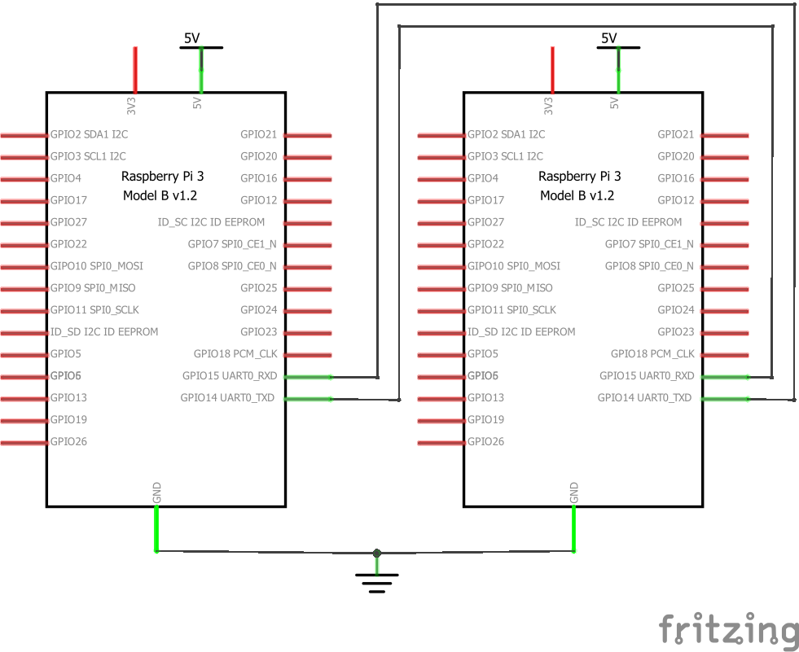

# Setup energy measurement

To use the energy measurement service, the two device have to send messages via UART communication. If the measured device is a Raspberry Pi 3, the following figure shows the proper wiring.



## Clone the porject

Clone this project to the Raspberry Pi.

```sh
cd ~
git clone https://github.com/vincedani/energy-measurement.git
export PYTHONPATH=$HOME/energy-measurement/:$PYTHONPATH
```

Whenever a new console is opened, the PYTHONPATH environment variable has to be set. It can be avoided via adding the export to the `~/.bashrc`.

## General information

The measurement service listens to its serial port and respond to the given commands. It recognizes two types of commands: START and STOP.

```python
    class Command(Enum):
      START = 1
      STOP  = 2
```

The messages have to be sent as serialized JSON objects.

```json
    { "command" : 1, "msg": "measurement_name" }
    { "command" : 2, "msg": "measurement_name" }
```

The integer value represents the command value. The "msg" part is the measurement ID. When a measurement has started with ID "abc_1", then it has to be stopped with the same ID. If this requirement is violated, the measurement is dropped without any saving.

Only one running measurement is allowed, the second request is dropped and the requester gets an error message.

