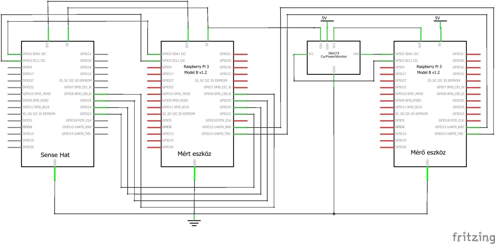

# Set up environment for running the use-case implementations

Source files (`01_sensors.{py, js, cpp}` and `04_led_matrix.{py, js, cpp}`) in `src` folder assume that a SenseHat extension board is connected to the Raspberry Pi. The remanining applications can be run without the SenseHat.

All the source files assume that the second Raspberry Pi is connected via the serial console as the following figure shows.



To run sources without the energy-measurement process, simply comment out the `communication_helper` connected rows from the source files.

## Prerequisites

Install the necessary packages with the following command.

```sh
sudo apt-get install -y build-essential libsystemd-dev libjpeg-dev sqlite3 libatlas-base-dev

sudo pip3 install systemd
```

Create the database from the given script.

```sh
cd src

sqlite3 weather_station.db
> .read weather_station.sql
> .exit
```

The first command creates the database file called `weather_station` with extension `db`. The `.read` command reads and executes the script.

## Python

The easiest way to run all applications from `src/Python` run the following command.

```sh
./scripts/usecase_runners/python_run.sh
```

The applications can be run separately (e.g. `src/Python/01_sensors.py`).

## C++

Sources have to be compiled before running. If you want to compile an application manually, the following script is a good starting point.

```sh
mkdir ./build
./scripts/usecase_runners/cpp_build.sh
```

The script builds all the sources under `src/C++` folder with `-O3` and the binaries are placed under `energy-measurement/build` folder.

The second stage is the running phase via the following command.

```sh
./scripts/usecase_runners/cpp_run.sh
```

## JavaScript

To run JavaScript programs in an embedded environemnt (like RPi3), we need an embedded JS engine. Now, this JS engine is the [JerryScript](https://github.com/jerryscript-project/jerryscript) with the [IoT.js](https://github.com/jerryscript-project/iotjs) framework.

The IoT.js has to be build first. Officially the RPi3 target is for Tizen OS only, so this project builds it to RPi2 - Linux target. The following script build the IoT.js properly with the neccessary modules.

```sh
./scripts/usecase_runners/iotjs_build.sh
```

The output folder is the `energy-measurement/build/iotjs`. After this stage, JS sources can be run with `./build/iotjs/arm-linux/release/bin/iotjs source.js` command or via the following script.

```sh
./scripts/usecase_runners/javascript_run.sh
```

### IoT.js modules

Developers can make native modules for the framework to extend its usabiliy. To run this project, 3 additional modules are needed. The `iotjs_build.sh` builds each of them.

#### SenseHat

The [SenseHat](https://github.com/vincedani/SenseHat/tree/master) repository is a C interface to the SenseHat extension board. The fork has an additional IoT.js native module for accessing it's features from JavaScript.

The module enables developers to query sensor values (humidity, pressure, temperature from pressure sensor and temperature from humidity sensor) and write LED values with `(x, y, r, g, b)` format.

See: [iotjs_build.sh](../scripts/usecase_runners/iotjs_build.sh), [01_sensors.js](../src/JavaScript/01_sensors.js) and [04_led_matrix.js](../src/JavaScript/04_led_matrix.js).

#### SQLite

The SQLite module is not a general purpose SQLite wrapper. It only enables us to call functions from [02_sqlite.cpp](../src/C++/02_sqlite.cpp) file. This module is just a test to measure how much energy is wasted via IoT.js bindings and framework.

See: [module](../iotjs_modules/sqlite) and [02_sqlite.js](../src/JavaScript/02_sqlite.js).

#### Sleep

The [sleep](https://github.com/hs0225/my_modules/tree/53f383daed44dad6ca231d79bdc10c17b243013c) is a general purpose module, which enables sync usleep method.